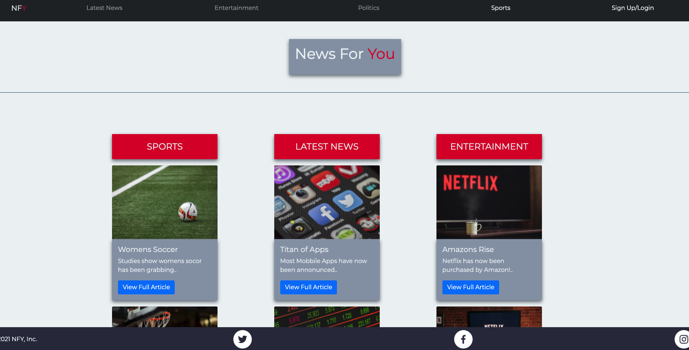
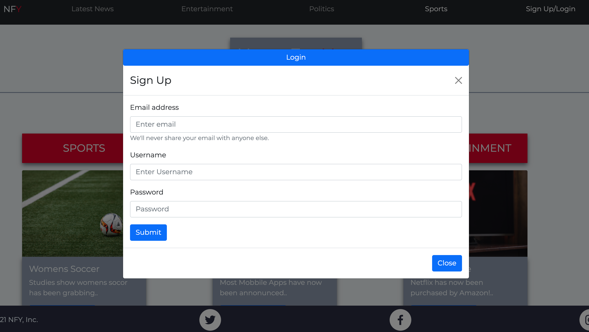

# News For You

News For You is a user friendly webpage designed for a new form of media that is more tailored to you than any other news website. In this website insted of just browsing the latest news you can also get the option to select which category of news you would like to view compared to other ones!

Below is a screenshot of the webpage when you first load in!

;

When you load in the webpage you will be greeted by the homepage with a Navbar at the top with the following categories of "Latest News, Entertainment, Politics, Sports, and Sign Up/Login". You are also met with 3 categories of Sports, Latest News, and Entertainment with differnt stories for these corresponding categories.

* When you press Sign Up/Login in the top right corner it will let you Sign Up

* On the same Modal it will also give you the option to Log In 

* When done signing up or logging in you can submit and then the Modal will close

* When the users Modal is closed he is then taken back to their dashboard

Below is a screenshot of the Modal when you go to Sign Up/Login!

This website was created using The following Technolgies

 - JavaScript

 - MySql

 - HTML

 - CSS

 - GraphQl

 - React

 - MongoDB

 - Node

 - Express
 
 - JSX

